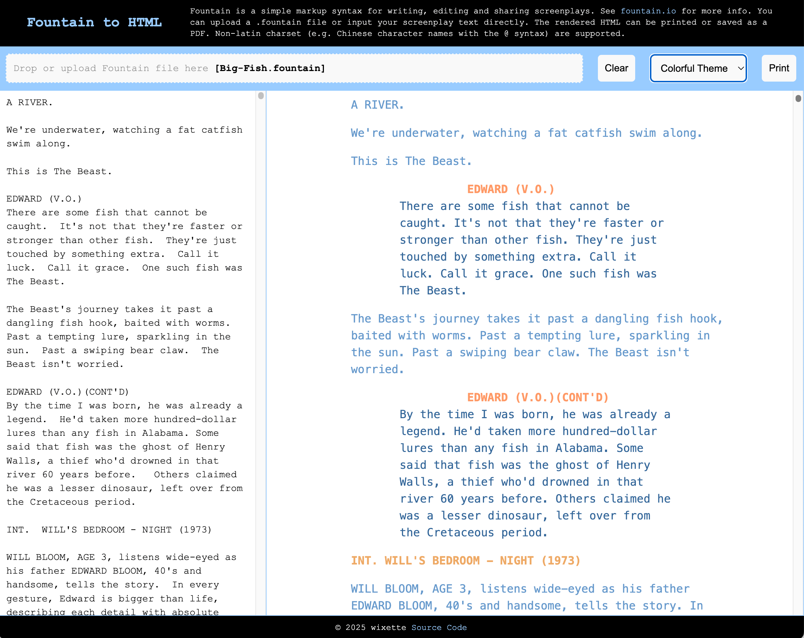
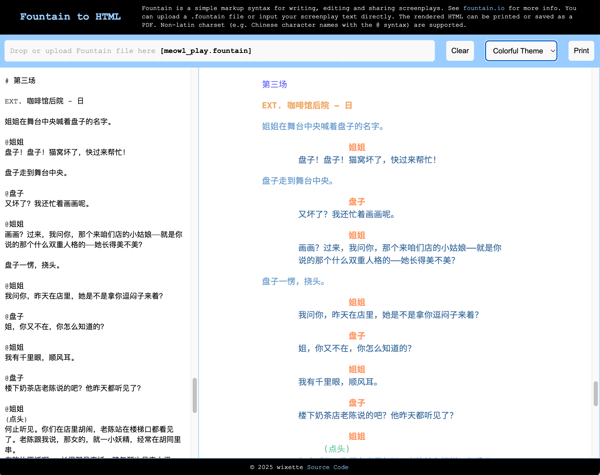

# fountain2html

A simple Node/JavaScript module to convert .fountain screenplays to HTML format,
with non-latin charset support.

Visit
[wixette.github.io/fountain2html/](https://wixette.github.io/fountain2html/) to
try it out online.

See the definition of Fountain format at [fountain.io](http://fountain.io/)

This project is partially derived from
[Fountain.js](https://github.com/mattdaly/Fountain.js), with the following
additional features:

- Non-latin charset support. E.g. Chinese character name preceded with the "at"
  symbol `@`, CJK action paragraphs, CJK-friendly themes, etc.
- Commandline interface to convert a .fountain file to HTML.
- `@media print` support, enabling page-break when printing.
- Predefined print-friendly themes, including colorful and high-contrast themes.

## Use the Web application

Visit
[https://wixette.github.io/fountain2html/](https://wixette.github.io/fountain2html/)
to use the web application.

You can also host and run `index.html` locally with any web server.

In the web app, you can drag and drop, or upload a .fountain file to the page,
and it will be converted to HTML. You can also select a theme from the dropdown
menu. The converted HTML will be rendered in the page and ready for printing.

## Use the command-line utility

Make sure you have Node.js and all yarn dependencies installed:

```bash
yarn install
```

Then use the following command to convert a Fountain file to HTML:

```bash
node . --theme=default example.fountain > example.html
```

## Screenshots

### Default theme


### Ocean theme


### Dark theme


### Colorful theme



### Chinese screenplay, CJK theme


### Chinese screenplay, colorful theme


