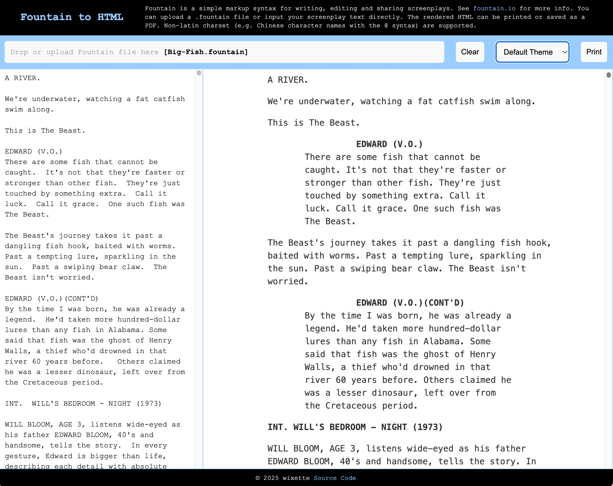
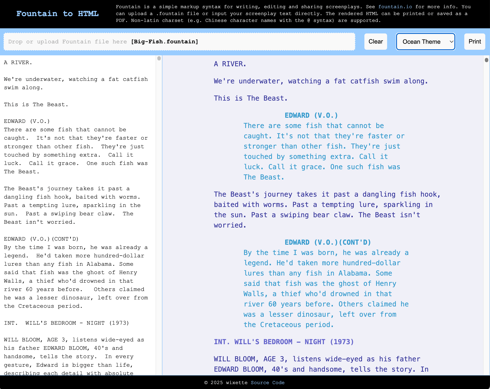
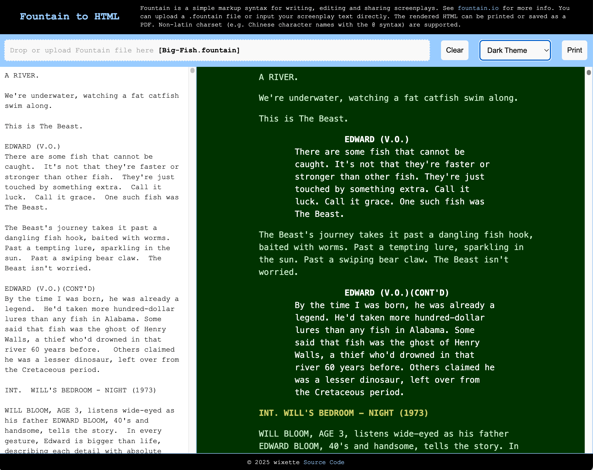
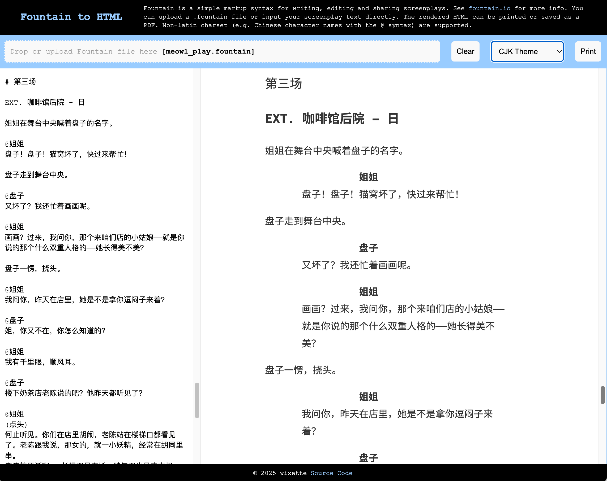

# Fountain 剧本格式转换器（fountain2html）

一个简单的 Node/JavaScript 模块，用于将 .fountain 剧本转换为 HTML 格式，

请访问
[wixette.github.io/fountain2html/](https://wixette.github.io/fountain2html/) 在
线试用 fountain2html 转换器。

Fountain 格式的语法定义和英文示例文件可以在 [fountain.io](http://fountain.io/) 上找到。

这个项目部分源自 [Fountain.js](https://github.com/mattdaly/Fountain.js), 并提供
了以下新功能：

- 支持非拉丁字符集。例如，中文角色名称前加 `@` 符号的语法，中日韩语的 Action 段
  落，东亚字体友好的 HTML 主题等。、
- 提供了基于 Node 的命令行接口，可在命令行将 .fountain 文件转换为 HTML。
- 支持 HTML CSS 中的 `@media print`，以便在打印时正确分页。
- 提供了预定义的适合打印的 HTML 主题，包括彩色主题、高对比度主题。

## 使用 Web APP

请访问
[https://wixette.github.io/fountain2html/](https://wixette.github.io/fountain2html/)
在线试用 fountain2html 转换器。

你也可以在本地使用任何 Web 服务器来托管和运行本项目根目录下的 `index.html`

在 Web APP 中，你可以将 .fountain 文件拖放到页面上，或直接上传文件，也可以直接在
编辑器中输入 Fountain 格式的剧本文本。剧本将自动被转换到 HTML 格式并在界面中更
新、显示。你可以使用“打印”按钮将格式化后的剧本打印输出，或打印到 PDF 文件。

## 使用命令行工具

确保你已经安装了 Node.js 和所有的 yarn 依赖项：

```bash
yarn install
```

然后使用以下命令将 Fountain 文件转换为 HTML：

```bash
node . --theme=default example.fountain > example.html
```

## Web APP 使用截图

### Default theme 英文剧本，缺省主题



### Ocean theme 英文剧本，海洋主题



### Dark theme 英文剧本，暗色主题



### Colorful theme 英文剧本，彩色主题


### Chinese screenplay 中文剧本，中日韩字体主题



### Chinese screenplay, 中文剧本，彩色主题


